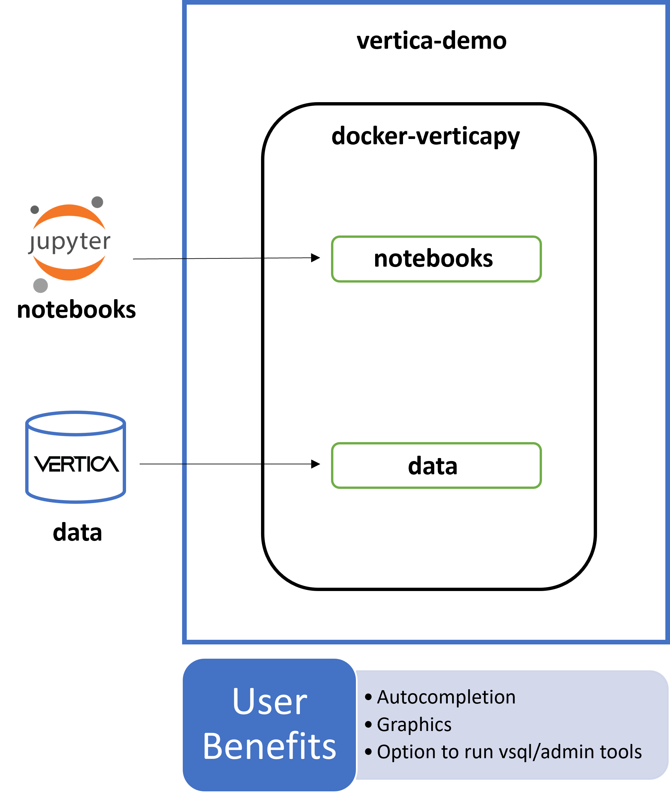

# Vertica Demo

This Docker image lets you create and run a single-node Vertica database 
on a local machine. It uses the Community Edition (CE) license (limited to  of 1TB of data).

The Docker image also includes VerticaLab, a custom JupyterLab environment. 
VerticaLab provides extensions for autocompletion, graphics, options to run
vsql or admintools, etc. and uses the lastest VerticaPy version.

## Quickstart

1. Clone this repository.
2. Open a terminal in the `vertica-demo` directory.
3. Build Vertica:
    ```
    make vertica-install
    ```

4. Build VerticaLab:
    ```
    make verticalab-install
    ```

5. Start Vertica:
    ```
    make vertica-start
    ```

6. Start VerticaLab:
    ```
    make verticalab-start
    ```

## Vertica CE Container

To create and start a new Vertica database:
```
make vertica-install
make vsql
```

To start vsql:
```
make vsql
```

To start vsql and run a query:
```
make vsql QUERY="'your-custom-query'"
```
or
```
bin/vsql -c "your-custom-query"
```

To stop Vertica:
```
make vertica-stop
```

To start Vertica with the previous database, if any:
```
make vertica-start
```

To delete the existing database:
```
make vertica-uninstall
```

To run admintools:
```
bin/admintools --help
```

To get the IP address of the container for use with external tools (e.g. a Jupyter notebook):
```
make get-ip
```

## VerticaLab

You can build a JupyterLab image with VerticaPy installed, and then use that image to create a container that imports your existing notebooks.

<div align="center">
    
</div>

### Prerequisites

A Vertica database. To get a simple single-node Vertica CE database, see the [Vertica quickstart guide](#Vertica-CE-Container).

### Quickstart - VerticaLab

1. Move the notebooks you want to import into the `vertica-demo/docker-verticapy/notebooks` directory.
2. Move the data you want to import into the `vertica-demo/docker-verticapy/data` directory.
3. (Optional) To use a different image name, set the `VERTICALAB_IMG` environment variable:
    ```
    export VERTICALAB_IMG=<your-custom-name>
    ```

4. Build VerticaLab:
    ```
    make verticalab-install
    ```

5. Start JupyterLab in docker. This creates a container on port 8889 (default):
    ```
    make verticalab-start
    ```

6. Open the displayed link in a browser.
7. To stop the container:
    ```
    make verticalab-stop
    ```

### Shared Volumes

By default, verticalab notebooks are isolated from the host machine and can only access files/dirs loaded at build time. However we offer the possibility to start from any directory of your choice. That way you will have access to the resources in that local directory and the changes you make will persist even after the container deletion. You just have to set VERTICALAB_PROJECT env var:

```
- VERTICALAB_PROJECT: the localhost path that will be used as shared volume with verticalab docker container
```
    
So if you want to use your home directory as shared volume:

```
make verticalab-start VERTICALAB_PROJECT=$HOME
```
If you want to use another directory:
```
make verticalab-start VERTICALAB_PROJECT=<your-dir>
```

### Additional Configuration

1. Create a configuration file:

    ```
    make config
    ```

2. Edit settings in the configuration file:

    ```
    vi config
    ```
    
### Setting PATH

If you want to run commands in `bin/` directly, add it to your PATH:

```
eval $(make env)
```
Or, to put it in your bash_profile for future logins:

```
make env >> ~/.bash_profile
```
